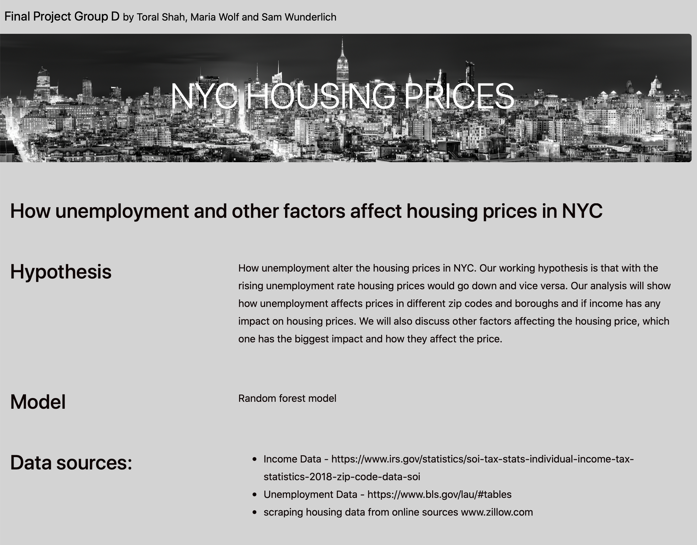
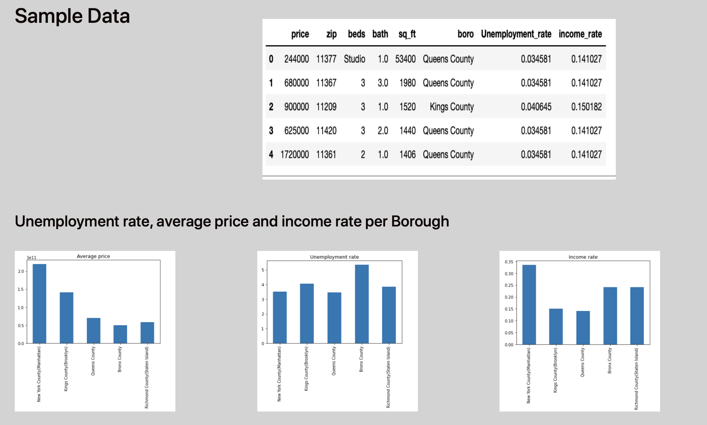
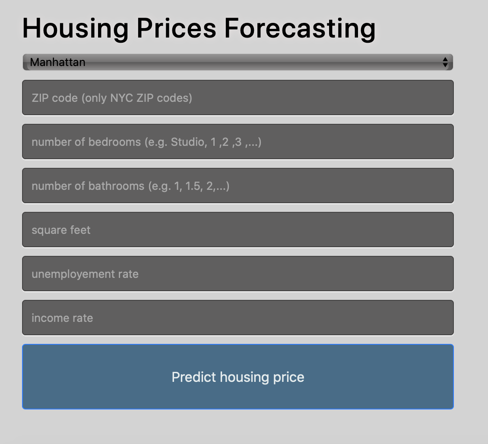

# FinalProjectGroupD
Final Team Project

## TOPIC
Predict housing prices in New York City with additional features around broad economic factors.  

### Reason 
* We are looking to predict housing prices in NYC.  As we currently are living through a global pandemic that is dramatically effecting the housing markets in and around the city.  We wanted to see if we could draw any correlation between COVID and these prices.  As we did our EDA we discovered that there is a bit of 'lag time' and 'volativity' between COVID cases directly and hosing prices.  Therefore, we chose our additional features (income & unemployment) over COVID cases direclty to remove what we saw as having a negative impact our our predictions.  We still feel that as additional data becomes available these additional features will continue to enhance the accruace of the model where as other housing models may not be able to adapt to these dramatic changes in the NYC housing market.

### Description - source of data
* We are planning to use three sources of data.
  * Unemployment Data - https://www.bls.gov/lau/#tables
  * Income Data from IRS - https://www.irs.gov/statistics/soi-tax-stats-individual-income-tax-statistics-2018-zip-code-data-soi
  * scraping housing data from online sources: price, sold date, sq ft, bedrooms, bathrooms, zipcode

* Database
  * pgAdmin
    * Table 1 - Housing Table
      * address
      * zipcode
      * Date Sold
      * number of bedrooms
      * number of Bathrooms
      * sq feet
      * Price
    
    * Table 2 - zipcode to boro (transaltion table)
        * zipcode
        * city
        * county
        * type
        * boro
     
     * Table 3 - Income
        * boro
        * number of people with income over 100k
        * number of people with income under 100k
      
     * Table 4 - Unemployed
        * boro
        * number of people employed
        * number of people unemployed

#google slides link
https://docs.google.com/presentation/d/1n89SRbyVxmuKiiazBlswaCqlmpPzC2FCLiZhE3vLW3k/edit?usp=sharing

### Description - Machine Learning Model

* Description of data preprocessing, feature engineering and feature selection, including decision-making process:
  * Data pre processing was done in three steps below
    * Data Selection - Housing data from zillow scraping, Income data from IRS, unemployment data from unemployment NY data. Unemployment and Income data is based on five NYC                          boro not by zip code while Housing data was captured by zipcode from zillow through scraping.
                      * Data was missing at zip code level for income and Unemployment tables
                      * After joining threee tables - income and unemployment data was translated into zipcode by boro. Another words, all income and unemployment data for all                         zip codes in that boro would have same data. This was one of the shortcomings of data that we found a workaround.
                      * Some redundant or unuseful data columns were dropped - for exmaple - county type, county name and city. 
                      * final columns are as below: Refer to house2data on GroupD_ML.ipynb file.
                      * price, address, zip, date, beds, bath, sq-ft, boro, employed, unemployed, income_Over_100k, income_below100k
                      
    * Data Processing - involved data formatting, cleaning and sampling.
                      * converted zip data type from int64 to str - since that is a number but in the form of a category.
                      * Dropped Null rows
                      * Eventhough - some of the zip codes had less than 10 counts, we decided not to merge and leave it as it is.
                      * Similarly for bath - data included some high number of baths with few rows - but after team discussions, we decided to keep those rows.
                      * Data included few high number of bedrooms but since they were only few - we decided to keep those rows as well.
                      * Price column - we removed skewed data < 11 rows
                      * deleted old dataframes as merged new df to releive the memory issues.
                      
     * Data Transformation- involved one hot encoder - to convert category columns for zipcode, bed, bath             
                      * so - final new5_df includes following: as int64 columns which will be analysis columns.
                          * price                  int64
                            sq_ft                  int64
                            Employed               int64
                            Unemployed             int64
                            income above 100k      int64
                  
                          * Following columns converted into category columns through one hot encoder after cleaning up.
                             beds_6               
                             beds_7              
                             beds_8              
                             beds_9               
                             beds_Studio
                             .....
                             boro_Kings County                                      
                             boro_New York County                                   
                             boro_Queens County                                     
                             boro_Richmond County  
                             bath_1.0', bath_2.0, bath_3.0......
                             
                          * Final transformed df - refer to :  transformed_scaled_data which is used to train and test dataset for ML models.

* Description of how data was split into training and test sets
  * transformed_scaled_data from original house2data file - is ready for ML model.
    * Our prediction is housing prices based on income, unemployment and other categories such as # of baths, sq ft, # of beds.
    * Therefore - prediction (dependent variable): y = price.value and x (independent variables) = all other categories but price
    * data is split into X_train, X_test, y_train and y_test
    
 * Explanation of model choice, including limitations and benefits
   * We used Linear Regression Model and Random Forest Classifier Model
   * We are trying to predict price which is a continuous variable meaning housing price can be any numerical value within a range. Therefore, we have decided to use regression      model instead of classification model where the target variable has only two possible values.
    
 * Explanation of changes in model choice (if changes occurred between the Segment 2 and Segment 3 deliverables), 
      * We decided to run Linear Regression - because Rain Forest ML required huge memory resources while Linear Regression does not require very complicated calculations, and           runs fast.
    
 * Description of how they have trained the model thus far, and any additional trining that will take place
      * We started training our model with sample database and then we added more data.
 
 * Description of current accuracy score
      * Mean Squared error from Rain Forest ML - 0.743
      * Mean Squared error from Linear Regression ML - 0.739
      * Both model showed similar numbers - so we decided to use Linear Regression ML.

### Description - Interactive App : FLASK 
    * to put our machine learning model into production we used Flask
    * front end created using HTML and CSS 
    * PICKLE Module used to store the model
    
    The Pickle module implements binary protocols for serializing and deserializing a Python object structure.
    
    Steps taken:
    1. in Jupyter notebook we created 5 Pickle files: 
    * encoder.pkl - pickle file for encoding cathegorical column Borough
    * encoderz.pkl - pickle file for encoding cathegorical column ZIP
    * scaler.pkl - pickle file for scaling numerical columns
    * scaler2.pkl - pickle file for scaling numerical column price
    * rfmodel.pkl - pickle file for random forest model
    
    2. pickle files loaded in Flask
    
    3. input values from our app were loaded in Flask
    
    4. scalers and encoders applied 
    
    5. input data ran trough our model
    
    6. y- predicted value scaled back to get results in $
    
    
    
    
      
### Questions we hope to answer

* housing prices by zipcode and a few housing options.
* use additional feautres to enhance the results.  Do these additional features enchance the models results as we move into a new  'market' while the city changes to adapt to COVID?
